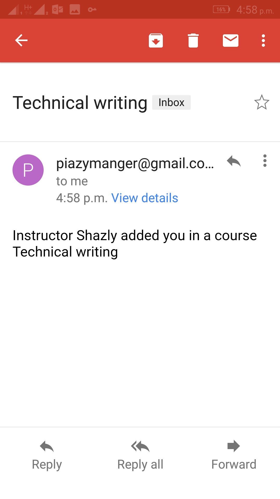

# Piazy-App
 An Android application which will help teachers and students to communicate more easier.

Table of contents
=================

<!--ts-->
   * [Technologies Used](#technologies-used)
   * [Prerequisites](#prerequisites)
   * [User Guide](#user-guide)
      * [Registeration](#registeration)
      * [Adding Courses](#adding-courses)
      * [Adding Posts or Resource Files](#adding-posts-or-resource-files)
      * [Emails and Notifications System](#emails-and-notifications-system)
   * [License](#license)
<!--te-->

Technologies Used:
==================
- FireBase Database to save posts and user accounts.
- FireBase Storage to save profile images for users.
- Java API Mail to send emails to students and instructors.
- Java 8 and Android Studio. 

Prerequisites:
=============
You should have an android system on a mobile and ability to download and install apk files.
apk link download:
https://drive.google.com/open?id=1spFqBIXi6t2IZ9_mAUZBfCULFLpUVP3i

User Guide:
===========

Registeration:
--------------------
  
  If you are a new user, the below view will appear.For registeration, press button register. 

   

      
   

Adding Courses:
--------------------
  
  In courses list,press the small pink button on the right bottom side of the screen for adding a new course. you should press    it to add new course (you can also sign out from side upper menu).
  

       
    

then you will be in add Course page you should write your course name, code and your university.
To add students and instructors, there is two edit text field and buttons beside them, you should enter students and instructor emails then push the button each time you enter the emails, then "waiting" word will appear then there will be 3 scenarioes:

1-) if this email is found  then "done" word wil appear.

2-) if this  email is not then "Not Found!!" word wil appear.

3-) if you add this email before "This email has been added before".

          
    

 
Adding Posts or Resource Files:
--------------------------------

  To add post you should press small pink button on the right bottom side of the screen(button in resource files tab to add file and in the post tab to add post) you should fill all required data.
 
 Note: only instructors can add new files to course.
 

      
    
 

after you add your post you will be at post screen which you can add comments like this:
 

       
     
  
 
Emails and Notifications System:
--------------------
  
  When you create course, all students and instructors will receive emails told them that they have been enrolled in this course. If any post is published or any file is added on this course, all instructors and students will receive emails tell them that.
  If anyone commented on a post, post owner,instructors and all  students who commented on the same post will get emails too.
     

         

     

and there is a notification tab to see all notifications:
    

       
    

License:
=======

Copyright (c) 2018 Mohamed Kamal El-Shazly

